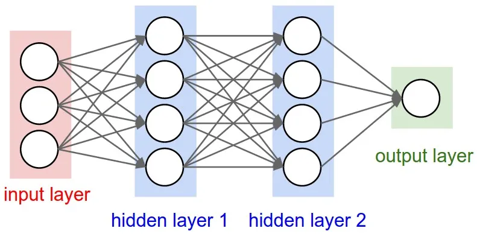
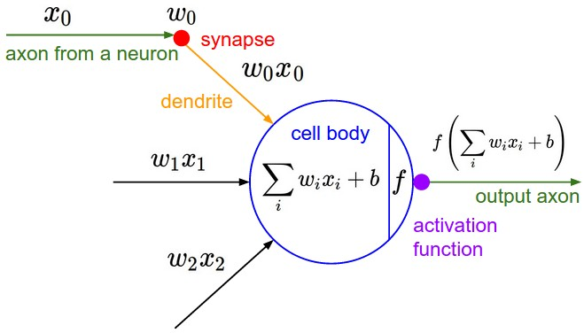

# Machine Learning (ML)

Machine Learning is a process of:
- *analyzing data*
- *learning from the data*
- *predicting on new data*

# Deep Learning (DL)

A subfield of ML inspired by the structure and functions of neurons in a human brain.

# Artifitial Neural Network (ANN)

- Computing systems of Deep Learning.
- A collection of connected **neurons**.
- Each connection can transmit a signal from one neuron to another.
- Neurons are orgainzed in layers:
  - Input layer
  - Hidden layers
  - Output layer



A simple ANN model in Keras (as ilustrated above)
```py
from keras.models import Sequential
from keras.layers import Input, Dense

model = Sequential([
    Input(3),   # input layer
    Dense(4),   # hidden layer 1
    Dense(4),   # hidden layer 2
    Dense(1)    # output layer
])

model.compile()
```

## Layers

- Dense (fully connected) - *connects each input with each output*
- Convolutional - *image data*
- Recurrent - *time series data*
- Pooling
- Preprocessing
- Normalization
- Regularization

[***Keras docs***](https://keras.io/api/layers/)


## Neuron

A neuron in a neural network works very simmilarly to a real neuron.




Description:
- $x$ (**input**) - output values of the previous layer
- $w$ (**weights**) - the weight of each input
- $b$ (**bias**) - effects when the neoron should/shouldn't fire
- $f$ (**activation function**) - a function that converts the wighted sum to a new output number


## Building a Model

### Activation Function

Defines an output based on the given inputs.

*Different neurons fire based on the different stimuli.*

The activation functions are defined when creating layers:
```py
new_layer = Dense(4, activation='relu')
```

All the activation functions can be found [**HERE**](activation_functions.md).

### Loss Function

The function that calculates the difference between model result and actual desired result. This difference is called the loss.

⚠️ *only works on labeled data*

```py
model.compile(loss='mean_squared_error')
```

[***Keras docs***](https://keras.io/api/losses/)

### Optimizer

The function responsible for modifing the weights in each iteration. It's main purpose is to minimize a given loss function.

```py
model.compile(optimizer='adam')
```

[***Keras docs***](https://keras.io/api/optimizers/)

### Learning Rate

The size of the steps taken towards an optimal (minimum loss) state.

⚠️ *️large steps can overshoot the optimal state*

- recommended learning rate is `0.01 > x > 0.0001`, the deafault is `0.001`

```py
from keras.optimizers import Adam

model.compile(optimizer=Adam(learning_rate=0.001))
```

### Regularization

A common technique to reduce overfitting. It helps the model to focus on more general patterns.

Regualizers add a penalty to the loss function.

- **L1**
  - `loss = 0.01 * reduce_sum(abs(x))`
- **L2**
  - `loss = 0.01 * reduce_sum(square(x))`

```py
new_layer = Dense(4, kernel_regularizer='l2')
```

[***Keras docs***](https://keras.io/api/layers/regularizers/)


## Data sets

### Training set

Labeled data on which the model learns.

### Validation set

Lableled data on which the model validates it's learning progress.

⚠️ *If the validation loss is larger than training loss, the model is overfitting*

```py
model.fit(validation_split=0.20)
```

### Testing set

Data on which the final model accuracy is evaluated.


```py
from sklearn.model_selection import train_test_split

X_train, X_test, y_train, y_test = train_test_split(X, y, test_size=0.20, shuffle=False)
```


## Training model

### Overfitting

The model is unable to generalize well.

When the model gets really good on training data, but does poorly on the test data.

A model is overfitting when the validation metrics are considerably worse than the training metrics.

**Solutions:**
- add more data
- data augmentation (eg. flipping images)
- add regularization
- add dropout - *randomly ignores some subset of nodes*

### Underfitting

The model is unable to calssify data it's being trained on.

A model is underfitting when the training metrics are poor.

**Solutions:**
- increase the complexity of the model
  - increase the number of layers
  - increase the number of neurons in a layer
  - change the type of layers
- add more features to the training data
- reduce dropout

### Epoch

A single pass of all the training data through the model.

- More epochs make the model better.
- Too many epochs can cause the model to be overfitted.

```py
model.fit(epochs=10)
```

### Batch Size

Ammount of items in a batch.
- The higher the batch size, the faster the training at the cost of utilizing more PC resources.
- Too large batches will negatively effect the model quality.

```py
model.fit(batch_size=32)
```