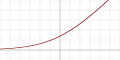
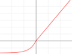
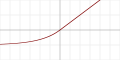
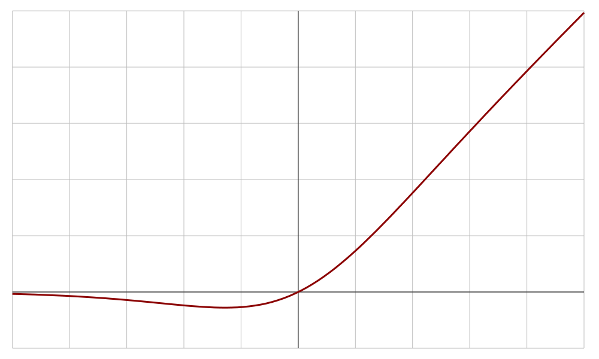
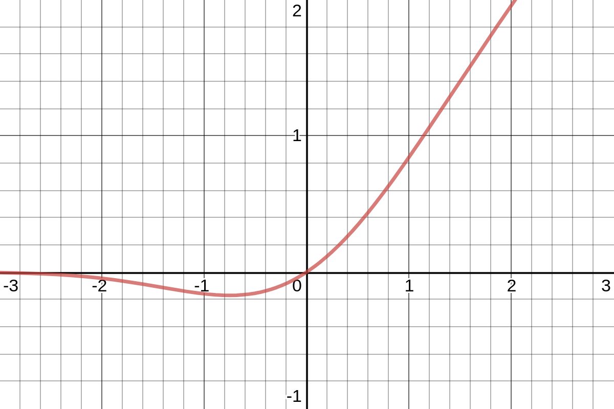

## `linear` (identity)

${\displaystyle x}$


## `relu` (Rectified Linear Unit)

${\displaystyle (x)^+ \doteq max(0,x)}$

`relu(x) = max(0, x)`


## `sigmoid`

${\displaystyle \sigma (x) \doteq \frac {1}{1+e^{-x}}}$

`sigmoid(x) = 1 / (1 + exp(-x))`


## `softmax`

${\displaystyle {\frac {e^{x_{i}}}{\sum _{j=1}^{J}e^{x_{j}}}}}$

`softmax(x) = exp(x) / sum(exp(x))`


## `softplus`

${\displaystyle \ln \left(1+e^{x}\right)}$

`softplus(x) = log(exp(x) + 1)`




## `softsign`

`softsign(x) = x / (abs(x) + 1)`


## `tanh` (Hyperbolic Tangent)

${\displaystyle \tanh(x)\doteq {\frac {e^{x}-e^{-x}}{e^{x}+e^{-x}}}}$

`tanh(x) = sinh(x) / cosh(x)`


## `selu` (Scaled Exponential Linear Unit)

${\displaystyle \lambda {\begin{cases}\alpha (e^{x}-1)&{\text{if }}x<0\\x&{\text{if }}x\geq 0\end{cases}}}$

${\displaystyle \lambda = 1.05070098}$<br>
${\displaystyle \alpha = 1.67326324}$

```py
scale = 1.05070098
alpha = 1.67326324

selu(x) = scale * x if x > 0 else
          scale * alpha * (exp(x) - 1)
```




## `elu` (Exponential Linear Unit)

${\displaystyle {\begin{cases}\alpha \left(e^{x}-1\right)&{\text{if }}x\leq 0\\x&{\text{if }}x>0\end{cases}}}$

```py
alpha = 1.67326324

elu(x) = x if x > 0 else
         alpha * (exp(x) - 1)
```




## `exponential`


## `leaky_relu` (Leaky Rectified Linear Unit)

${\displaystyle {\begin{cases}0.01x&{\text{if }}x\leq 0\\x&{\text{if }}x>0\end{cases}}}$


## `relu6`

${\displaystyle (x)^+ \doteq min(6, max(0,x))}$

`relu6(x) = min(6, max(0, x))`


## `silu` (Sigmoid Linear Unit / Swish)

${\displaystyle {\frac {x}{1+e^{-x}}}}$

`swish(x) = x * sigmoid(x)`




## `gelu` (Gaussian Error Linear Unit)

${\displaystyle {\begin{aligned}&{\frac {1}{2}}x\left(1+{\text{erf}}\left({\frac {x}{\sqrt {2}}}\right)\right)=x\Phi (x)\end{aligned}}}$

`gelu(x) = 0.5 * x * (1 + erf(x / sqrt(2)))`




## `hard_sigmoid`

```py
hard_sigmoid(x) = 0 if x < -2.5 else
                  1 if x > 2.5 else
                  0.2 * x + 0.5
```


## `mish`

`mish(x) = x * tanh(softplus(x))`


## `log_softmax`